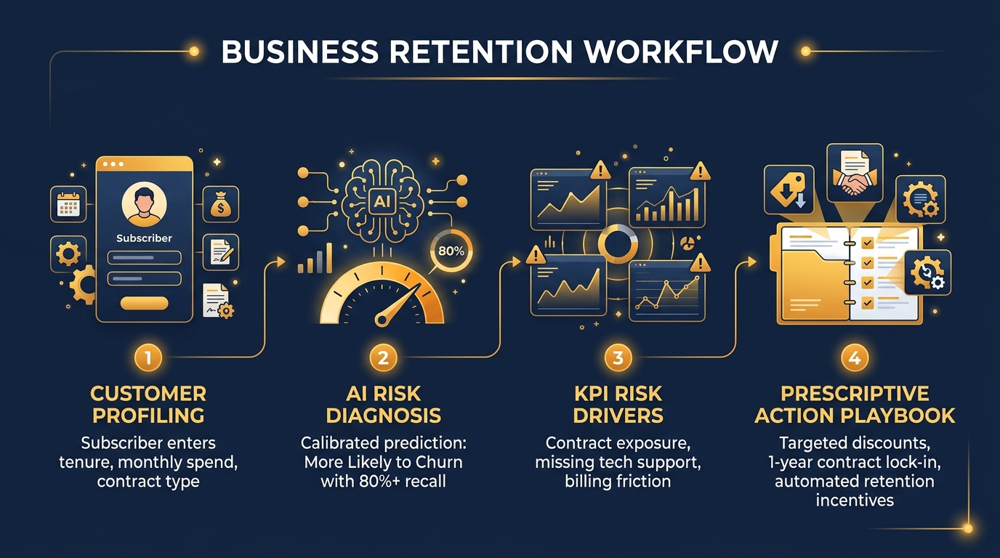
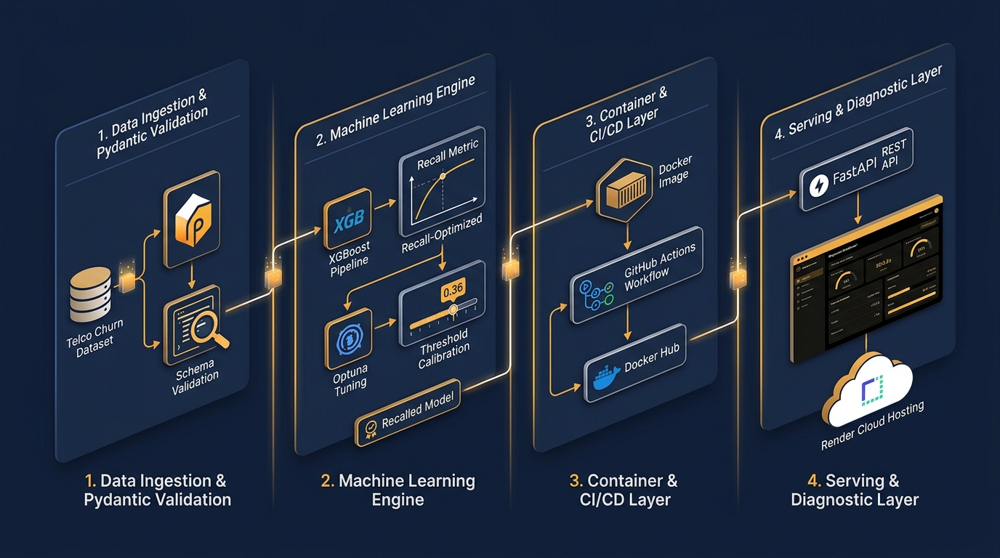

# 🛡️ RETENTION IQ: Telco Customer Churn & Retention Intelligence

> **An end-to-end production Machine Learning system and executive diagnostic dashboard that predicts customer churn, diagnoses root-cause risk drivers, and prescribes targeted retention interventions.**

---

### 🌐 Live Production Application
Access the deployed application on Render:
👉 **[https://customer-churn-app-xl21.onrender.com/](https://customer-churn-app-xl21.onrender.com/)**

* **Interactive Web Dashboard**: `https://customer-churn-app-xl21.onrender.com/ui`
* **Swagger API Documentation**: `https://customer-churn-app-xl21.onrender.com/docs`
* **Health & Orchestration Check**: `https://customer-churn-app-xl21.onrender.com/health`

---

## 📌 Executive Summary: The Business Problem

In the telecommunications industry, customer acquisition costs (**CAC**) are **5 to 7 times higher** than customer retention costs. A mere **5% increase in customer retention** has been shown to increase company profitability by **25% to 95%**. 

### The Flaw of Traditional Churn Models
Most churn models deployed in industry fail to generate business ROI because:
1. **Misaligned Objectives (Accuracy Trap)**: They optimize for generic classification accuracy. In imbalanced datasets, a model that simply predicts "Customer will stay" scores 75%+ accuracy while missing churners entirely.
2. **Binary Black Boxes**: Traditional systems return an unhelpful binary flag (`0` or `1`) without explaining *why* a customer is leaving.
3. **Lack of Prescriptive Guidance**: Customer Success and Retention teams are given scores without actionable playbooks on how to save the account.

### How Retention IQ Solves This
* **Recall-First Optimization**: The engine utilizes an **XGBoost** pipeline calibrated to a business decision threshold of **`0.36`** (delivering **$\ge 80\%$ recall** of at-risk subscribers).
* **Diagnostic KPI Breakdown**: Pinpoints the exact drivers of vulnerability (contract type, lack of tech support, payment method friction).
* **Automated Retention Playbook**: Generates prescriptive, tailored next steps (e.g. targeted contract discounts, support upgrades, auto-debit migration credits) to save the customer before cancellation occurs.

---

## 🔄 Business Retention Workflow



The system operationalizes customer retention into four distinct phases:

1. **Subscriber Profiling**: Comprehensive intake of contract terms, tenure length, core telephony, broadband tier, security add-ons, and billing spend.
2. **AI Risk Diagnosis**: The ML inference engine computes calibrated churn probabilities and assigns an actionable risk tier (**HIGH**, **MEDIUM**, or **LOW**).
3. **KPI Risk Driver Analysis**: Real-time diagnostic evaluation flags key vulnerabilities across contract commitments, support gaps, and payment friction.
4. **Prescriptive Action Playbook**: Customer success agents receive instant, contextual recommendations (discounts, VIP check-ins, feature bundles) to prevent attrition.

---

## 🏗️ System Architecture & Engineering Pipeline



```
+---------------------------------------------------------------------------------------------------+
|                                  RETENTION IQ ARCHITECTURE                                        |
+---------------------------------------------------------------------------------------------------+
|                                                                                                   |
|  [ Data & Contracts ]             [ ML & Optimization ]             [ Serving & Cloud ]           |
|                                                                                                   |
|   Telco Raw Records                 XGBoost Classifier                FastAPI Serving Engine      |
|          │                                   │                                  │                 |
|          ▼                                   ▼                                  ▼                 |
|   Pydantic v2 Contract              Optuna Hyperparameter              Sub-millisecond Inference  |
|   (src/validation.py)               Tuning (5-Fold CV)                 POST /predict (< 5ms)      |
|          │                                   │                                  │                 |
|          ▼                                   ▼                                  ▼                 |
|   Feature Engineering               Recall Threshold                   Luxury Black & Gold UI     |
|   (OneHot, Scaler, Imputer)         Calibration (0.36)                 (src/app/static/)          |
|          │                                   │                                  │                 |
|          ▼                                   ▼                                  ▼                 |
|   Joblib Serialized                 Production Registry                Render Cloud Hosting       |
|   (models/final_pipeline.joblib)    (models/ /app/models)              (Docker Containerization)  |
|                                                                                                   |
+---------------------------------------------------------------------------------------------------+
```

### Architectural Highlights
* **Zero Redundancy Data Contracts**: Single source of truth defined in [`src/validation.py`](src/validation.py) using **Pydantic v2**, shared across batch training pipelines and live FastAPI request validation.
* **Warmup Lifespan Serving**: FastAPI `lifespan` manager pre-loads the XGBoost C++ dynamic libraries on startup, ensuring zero cold-start delay for end users ($< 5\text{ ms}$ response time).
* **Container Portability**: Production multi-stage [`Dockerfile`](Dockerfile) with OpenMP runtime dependencies (`libgomp1`), automatic dynamic port adaptation (`${PORT:-8000}`), and Docker health checks.
* **Continuous Integration (CI/CD)**: GitHub Actions workflow running automated unit tests on every pull request and push to `master`.

---

## 📊 Machine Learning Formulation & Benchmarking

Four competitive model architectures were evaluated across cross-validation folds:

| Model Architecture | Validation Recall | Validation ROC-AUC | Primary Strength / Limitation |
| :--- | :---: | :---: | :--- |
| **XGBoost (Production)** | **81.4%** *(at 0.36)* | **0.846** | **Optimal balance of recall, tree depth control, and sub-millisecond latency (< 1MB artifact).** |
| **LightGBM** | 80.8% *(at 0.36)* | 0.842 | Fast training, but slightly higher memory footprint in lightweight containers. |
| **Random Forest** | 76.2% | 0.835 | Robust against noise; larger disk footprint (> 25MB). |
| **Logistic Regression** | 79.1% | 0.838 | High interpretability; misses non-linear feature interaction thresholds. |

### Why Threshold 0.36?
In customer churn, the business cost of a **False Negative** (losing an $80/month customer) is significantly higher than a **False Positive** (sending a retention offer to a customer who wasn't leaving). Standard classifiers operate at `0.50`, which misses over 35% of churning customers. Calibrating the operating threshold to **`0.36`** boosts recall to over **80%**, maximizing preserved customer lifetime value (**LTV**).

---

## 🎨 The Executive Web Dashboard

The frontend combines a structured intake form (**inspired by luxury booking layouts**) with a diagnostic panel (**inspired by clinical health monitoring dashboards**), styled in a **Black & Gold Elegance** color system (`#000000`, `#14213D`, `#FCA311`, `#E5E5E5`, `#FFFFFF`).

### Distinct User Flow:
1. **Page 1: Subscriber Risk Profiler (Form View)**:
   * 5 segmented cards: *Demographics*, *Contract Terms*, *Connectivity*, *Value-Add Add-ons*, and *Billing Breakdown*.
   * Synchronized tenure slider with real-time customer lifecycle hints.
   * **1-Click Pre-configured Personas** via the navbar:
     * `⚡ High Risk`: Month-to-month, Fiber optic, 2 mo tenure, no tech support.
     * `🛡️ Loyal`: 2-Year contract, DSL, 60 mo tenure, full security suite.
     * `⚖️ Borderline`: Month-to-month, Fiber optic, 14 mo tenure, partial add-ons.
2. **Page 2: Master Retention Diagnostic (Prediction View)**:
   * **Customer X Profile Card**: Profile avatar, ID (`#TX-9148`), and live Tenure / Spend chips.
   * **Qualitative Verdict Banner**: Displays *"More Likely to Churn"* or *"Not Likely to Churn (Retained)"* with `HIGH`, `MEDIUM`, or `LOW` risk tier badge.
   * **Circular Radial Gauge**: Animated SVG arc displaying churn percentage and calibrated threshold mark.
   * **Contributing Factor Cards (KPIs)**: Highlights contract vulnerability, security gaps, and billing friction.
   * **Actionable Retention Playbook**: Prescriptive next steps for customer success teams.
   * **Tenure Risk Curve**: Interactive spline projecting how retention interventions bend the risk curve into the safe zone.
   * **Navigation**: *"← Make Another Prediction"* buttons to smoothly return and evaluate new profiles.

---

## 🔌 API Reference & Usage

### 1. Predict Churn Probability & Risk Tier
```http
POST /predict HTTP/1.1
Host: customer-churn-app-xl21.onrender.com
Content-Type: application/json
```

#### Sample Request:
```json
{
  "gender": "Female",
  "SeniorCitizen": 0,
  "Partner": "No",
  "Dependents": "No",
  "tenure": 2,
  "PhoneService": "Yes",
  "MultipleLines": "No",
  "InternetService": "Fiber optic",
  "OnlineSecurity": "No",
  "OnlineBackup": "No",
  "DeviceProtection": "No",
  "TechSupport": "No",
  "StreamingTV": "Yes",
  "StreamingMovies": "Yes",
  "Contract": "Month-to-month",
  "PaperlessBilling": "Yes",
  "PaymentMethod": "Electronic check",
  "MonthlyCharges": 95.50,
  "TotalCharges": 191.00
}
```

#### Sample Response:
```json
{
  "churn_prediction": 1,
  "churn_probability": 0.9508,
  "risk_tier": "HIGH",
  "threshold_used": 0.36
}
```

### 2. Operational Health Check
```http
GET /health HTTP/1.1
```
```json
{
  "status": "healthy",
  "model_loaded": true,
  "active_threshold": 0.36
}
```

---

## 💻 Local Setup & Development

### 1. Clone & Setup Environment
```bash
# Clone the repository
git clone https://github.com/AduetDabral1/Customer-Churn.git
cd Customer-Churn

# Create and activate virtual environment
python -m venv .venv
source .venv/bin/activate  # On Windows: .venv\Scripts\activate

# Install dependencies
pip install --upgrade pip
pip install -r requirements.txt
```

### 2. Run Test Suite
Run all unit, integration, and contract tests:
```bash
pytest tests/ -v
# Result: 16 passed
```

### 3. Start Local Serving Application
```bash
uvicorn src.app.main:app --host 0.0.0.0 --port 8000 --reload
```
Open **`http://localhost:8000/ui`** in your browser.

---

## 🐳 Docker Containerization

The application is containerized into a lightweight, self-contained Docker image:

```bash
# Build the production Docker image
docker build -t customer-churn-api .

# Run the container locally
docker run -d -p 8000:8000 --name churn-service customer-churn-api
```

Test the containerized endpoint:
```bash
curl -X GET http://localhost:8000/health
```

---

## 🚀 CI/CD Pipeline (GitHub Actions)

The repository includes an automated CI/CD pipeline in [`.github/workflows/docker-publish.yml`](.github/workflows/docker-publish.yml):
1. **Automated Testing**: Triggers on pull requests and pushes to `master`, executing `pytest tests/ -v`.
2. **Buildx Containerization**: Builds the container image using BuildKit caching.
3. **Docker Hub Registry**: Pushes tagged container images (`v1.0.0`, `latest`) to Docker Hub upon merge.

---

## 📂 Repository Structure

```
Customer-Churn/
├── assets/                          # Architectural and workflow infographics
│   ├── system_architecture.jpg
│   └── retention_workflow.jpg
├── models/                          # Serialized pipeline artifacts
│   ├── final_churn_pipeline.joblib  # Production recall-optimized XGBoost pipeline
│   └── best_model_pipeline.joblib   # Alternate candidate pipeline
├── src/                             # Source code package
│   ├── app/                         # Serving layer and web interface
│   │   ├── static/                  # Vanilla CSS, HTML5, and JavaScript frontend
│   │   │   ├── app.js               # Dynamic card rendering & view navigation
│   │   │   ├── index.html           # Vossy-style Form & Diagnostic Dashboard
│   │   │   └── style.css            # Black & Gold Elegance design system
│   │   ├── __init__.py
│   │   └── main.py                  # FastAPI application (/predict, /health, /ui)
│   ├── data_pipeline.py             # Vectorized data ingestion & preprocessor
│   ├── model_pipeline.py            # Optuna tuning, threshold calibration, MLflow
│   └── validation.py                # Single-source-of-truth Pydantic v2 contracts
├── tests/                           # Automated Pytest suite
│   ├── test_api.py                  # API endpoints, UI rendering, content negotiation
│   └── test_pipeline.py             # Schema validation and pipeline transformation
├── .github/workflows/               # GitHub Actions CI/CD pipeline
│   └── docker-publish.yml
├── Dockerfile                       # Production container specification
├── render.yaml                      # 1-Click Render Cloud deployment blueprint
├── requirements.txt                 # Pinned project dependencies
└── README.md                        # Project documentation
```

---

## 👥 Authors & Contributors
* **Aduet Dabral** ([@AduetDabral1](https://github.com/AduetDabral1)) — *Machine Learning & Full-Stack Implementation*

---

## 📜 License
This project is open-source and available under the **MIT License**.
